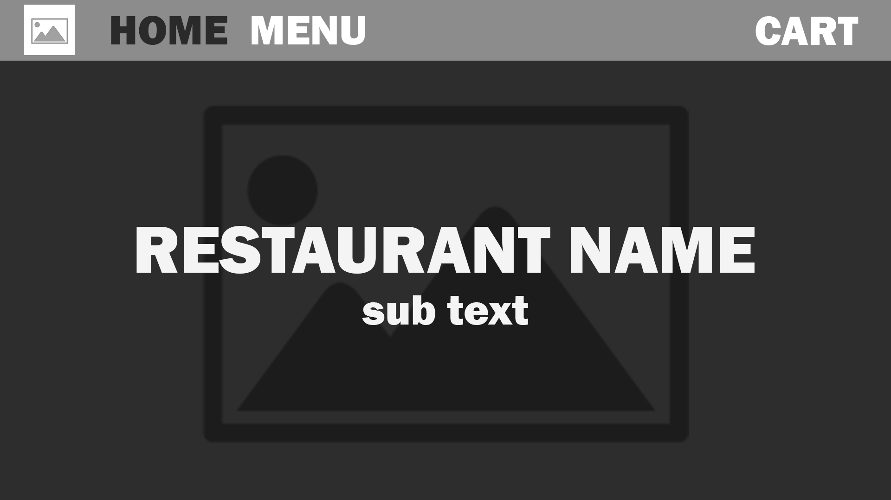
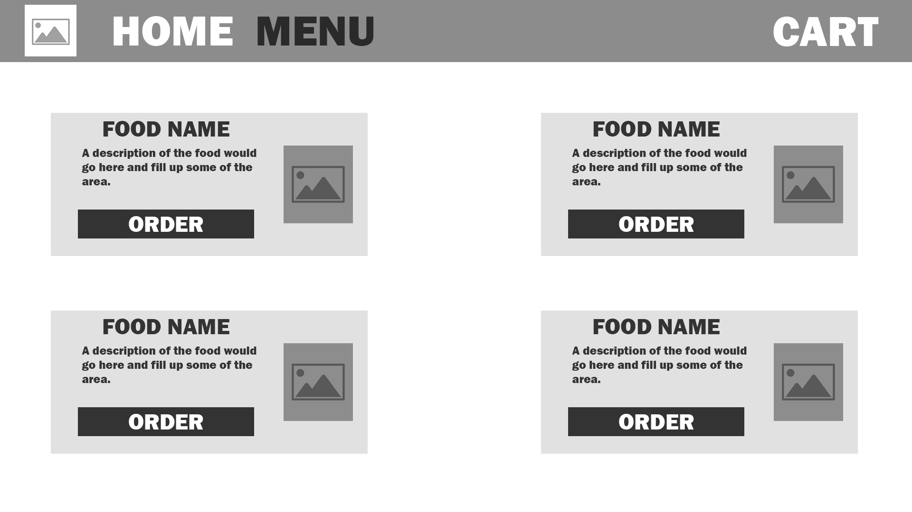
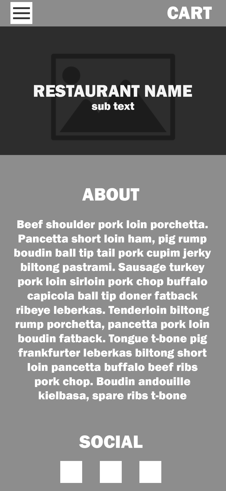
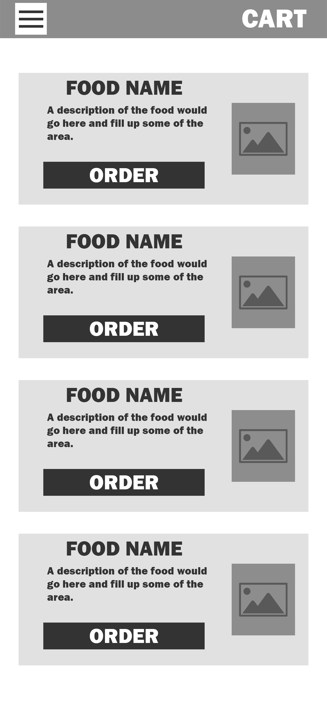

# Wireframes

 

 

# `Both`

## `Navbar`
Navbar should condense into a hamburger menu with smaller devices
- Maybe have an icon for the restaurant
- Home button should take you to `home`
- Menu button should take you to `menu`
- STRETCH GOAL: Have a `cart` for online orders

# `Home`
- Background Image with Restaurant name over it, maybe sub text
- Scroll to see `about` and `social links`

## `About`
- Location and Hours
## `Social Links`
- Simple a tag links

# `Menu`
- display `cards` responsively

## `Cards`
- `Food Name`
- `Food Description`
- Maybe have an Image
- STRETCH GOAL: Order Button to add item to `cart`

### `Food Name` and `Description` are pulled from the API